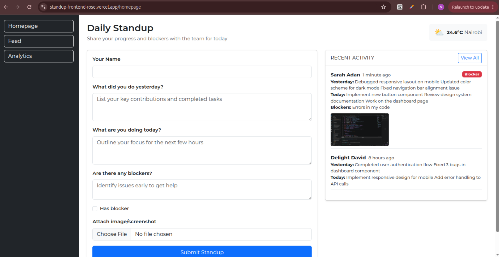
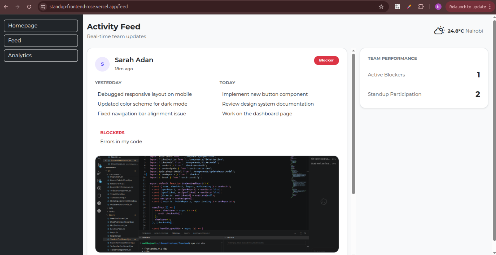
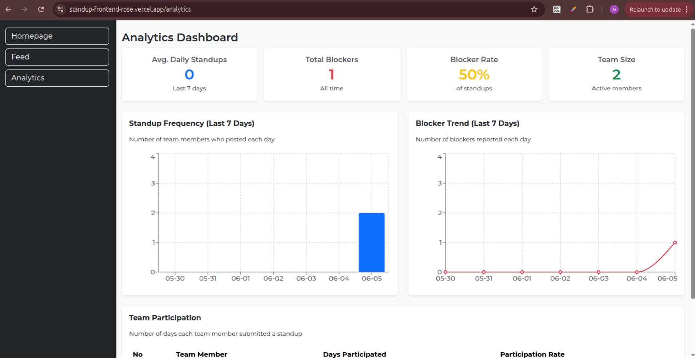

# StandupSync - Team Standup Logger

A lightweight internal tool where team members can post daily standup updates, view live activity feed, and managers can track team health with analytics dashboard.

## Features

Submit standup updates (yesterday, today, blockers) with file attachments
Live activity feed with auto-refresh (polling every 10 seconds)
Weather widget showing Nairobi weather
Analytics dashboard with charts (posts per day, blocker trends, team participation)
Responsive design with Bootstrap 5

## Screenshots

### Homepage


### Activity Feed


### Analytics


## Live Demo

- **Frontend**: [Standup App- frontend](https://standup-frontend-rose.vercel.app/)
- **Backend API**: [Standup App- backend](https://standup-backend-v4n5.onrender.com)

## Tech Stack

Frontend - React, Bootstrap 5, Recharts, Axios 
Backend -Flask, SQLAlchemy, Flask-CORS |
Database - PostgreSQL (Render) / SQLite (local) |
Deployment - Render(backend),Vercel(frontend)
APIs - Open-Meteo 

## Local Setup

```bash
# Install dependencies
npm install

# Start development server
npm run dev